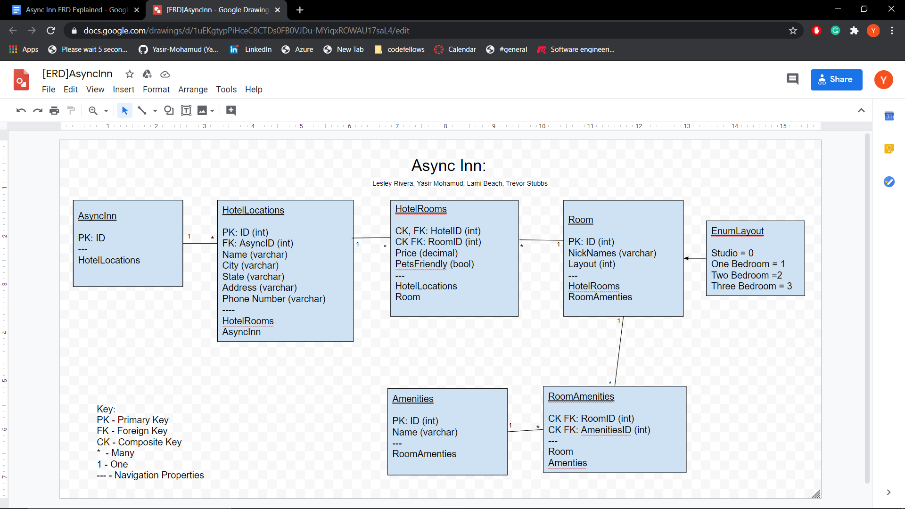

# Async-Inn

*Author: Yasir Mohamud*

----

## Description
## ASYNC INN
----------
This is a ASP.NET web application where we have data stored in different databases and we use different api calls to get the information from the database.
## ERD 
Shows the connection of databases and their relations between them.
Async Inn ERD Explained

Async Inn - Table 1:
The table holds the primary key ID. You could do without the first table, however, you can’t start a table with many to many. You need one to many. 

Hotel Locations - Table 2:
The table holds a primary key for the hotel location and a foreign key of the Async Inn ID as the Hotel Location references Async Inn. It has the properties of name, city, state, address, and phone number.
Navigation: Hotel Rooms, Async Inn


Hotel Rooms(Joint Entity Table with Payload) - Table 3:
Has a composite key/foreign key of HotelID as it references Hotel Locations. It also has a composite key of RoomNumbers which is specific to the rooms. It references the Price and whether PetsFriendly as the payload.
Navigation: Hotel Location, Room.


Room - Table 4:
This table has a primary key of ID as its reference. It contains the properties of Nicknames of hotel rooms, Layout which is an enum to determine how many bedrooms.
Navigation: Hotel Rooms, Room Amenities.

Enum Layout (Enum) - Table 5:
The enum Layout table contains the properties of studio set equal to zero, one bedroom equal to one, two bedrooms  equal to two, and three bedrooms equal to three. These properties specify the number of rooms to pick from. 
	

Amenities - Table 6:
This table has a primary key of ID for its reference. The property is the Name of the amenities. 
Room Amenities.


Room Amenities (Pure Joint Entity Table) - Table 7:
The table contains a composite key/foreign key of the RoomID as to reference the Room table. It also has a composite key/foreign key of AmenitiesID as to reference the actual amenities. 
Navigation: Room, Amenities.


---

### Getting Started
Clone this repository to your local machine.

```
$ git clone [https://github.com/Yasir-Mohamud/Async-Inn.git]
```

### To run the program from Visual Studio:
Select ```File``` -> ```Open``` -> ```Project/Solution```

Next navigate to the location you cloned the Repository.

Double click on the ```Async-Inn``` directory.

---

### Visuals
*ERD*


---

### Change Log
1.4 * Adding join tables and navigation properties* - July 27,2020
1.3 *dependency injection* - July 22,2020
1.2 *Adds ASP.NET web application* - July 21,2020
1.1: *Added README* - July 20,2020  


